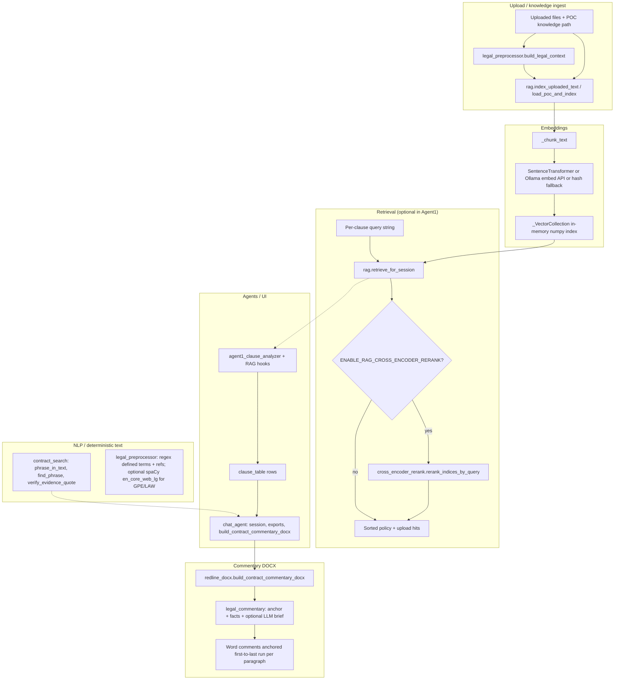

# Commentary export and retrieval flow

How Word commentary DOCX export relates to embeddings, search, preprocessing, and Agent1/chat. See also `docs/CONTRACT_HYBRID_PIPELINE_REPORT.md` and `docs/WORKFLOW_AND_AGENTS.md`.

## Mermaid overview

## Module roles (concise)

| Piece | Role |
|--------|------|
| `rag.py` | Chunks text (~1400 chars, overlap 300), embeds via `LOCAL_EMBED_MODEL` / Ollama / offline hash vectors, stores in numpy collections; `retrieve_for_session` merges policy + session upload hits and optionally cross-encoder reranks the top pool. |
| `cross_encoder_rerank.py` | Lazy `CrossEncoder` (sentence-transformers); reorders candidate chunks by query–passage score; on failure returns identity order. |
| `contract_search.py` | No neural model: normalized substring / token-gap phrase search and evidence windows for prompts. |
| `legal_preprocessor.py` | Regex-heavy defined terms and cross-references; **spaCy** (`en_core_web_lg`) only if installed—adds LAW/GPE-like entities to jurisdiction hints; silently skips if model missing. |
| `agent1_clause_analyzer.py` | Clause extraction; may call `rag.retrieve_for_session` when RAG session id is set. |
| `chat_agent.py` | Orchestrates uploads, optional RAG indexing on ingest, analysis pipeline, and calls `build_contract_commentary_docx` for legal commentary export. |
| `redline_docx.py` | Matches clause evidence to flattened DOCX paragraphs, then `legal_commentary` assembles comment text; **comments use first and last paragraph runs** so Word highlights the full paragraph. |
| `legal_commentary.py` | Deterministic anchor (paragraph index + sentence map) + compact facts block + optional classify-model brief. |

## NLP gaps

- **spaCy** is optional enrichment only; core flows do not depend on it.
- **RAG** is not always on the hot path for chat (knowledge may be injected as structured text); when RAG is off or empty, Agent1 still runs with other context.
- **Cross-encoder** is off unless `ENABLE_RAG_CROSS_ENCODER_RERANK` and a model name are configured (CPU default to avoid fork/MPS issues).

## Knowledge alignment (Appendix-style sources)

There is no single file literally named `appendix_3` under `docs/`. POC uploads often include filenames such as `Appendix_3_...docx` (see `rag._chunk_metadata_hints`). For how **GB ideal / standard positions** map from knowledge DOCX to clause rows (what commentary should align to), use **`docs/knowledge/KNOWLEDGE_PARSER_MAPPING_REPORT.md`** (`ideal_position` → GB ideal; Position 1 primary) and **`docs/KNOWLEDGE_DOCX_VERIFICATION_REPORT.md`** (consumer field mapping).
