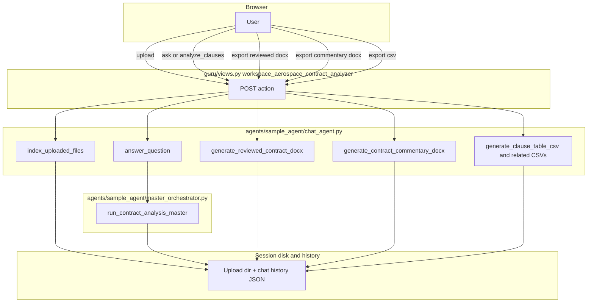
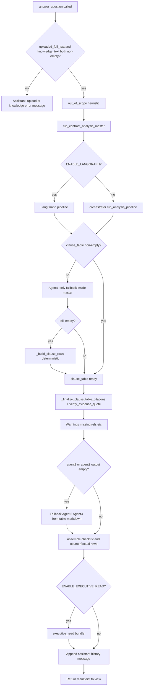
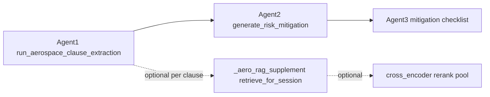
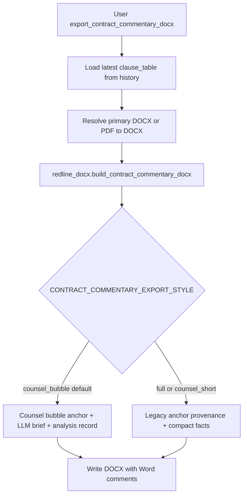

# Current contract analysis process (code-accurate)

This document describes **only what the codebase does today** for the Aerospace Contract Analyzer: browser → Django → `agents.sample_agent.chat_agent` → agents, RAG, and exports. It is derived from the current implementation in this repository (not a future design).

**Primary code paths**

| Area | Module(s) |
|------|-------------|
| HTTP UI | `guru/views.py` → `workspace_aerospace_contract_analyzer` |
| Session, uploads, analysis, exports | `agents/sample_agent/chat_agent.py` |
| Analysis routing | `agents/sample_agent/master_orchestrator.py` |
| Linear Agents 1→2→3 | `agents/sample_agent/orchestrator.py` |
| Clause extraction | `agents/sample_agent/agent1_clause_analyzer.py` |
| Risk narrative | `agents/sample_agent/agent2_reviewer.py` |
| Checklist | `agents/sample_agent/agent3_mitigation_checklist.py` |
| Vector store + retrieval | `agents/sample_agent/rag.py` |
| Retrieve rerank | `agents/sample_agent/cross_encoder_rerank.py` |
| Redline / commentary DOCX | `agents/sample_agent/redline_docx.py` |
| Word comment body (default layout) | `agents/sample_agent/legal_commentary.py` |
| Async job (optional) | `guru/tasks.py`, `guru/views_analysis.py`, `agents/sample_agent/supervisor_orchestrator.py` |

---

## 1. Session and storage

- Each browser session has a Django `session_key`. That key is used as **`session_id`** for `chat_agent`.
- Uploads are written under `chat_agent.UPLOAD_ROOT / session_id /` with metadata in memory (`SessionState`) and optional manifests (e.g. upload roles).
- **Chat history** (including the latest `clause_table`) is appended on each successful analysis and can be persisted to disk for reload.

---

## 2. Upload path (`action == "upload"`)

1. User posts files to `workspace_aerospace_contract_analyzer`.
2. View calls `chat_agent.index_uploaded_files(session_key, uploads, upload_role=...)`.
3. For each file: validate extension/size → `_save_upload` → `_extract_text` (PDF/DOCX path; PDF may fall back to page images if no text).
4. Optional **`legal_preprocessor.build_legal_context`** stored on the artifact.
5. **Optional immediate per-file vector index** (only if `ENABLE_RAG` and `ENABLE_VECTOR_RETRIEVER` and `INDEX_UPLOAD_ON_UPLOAD`): `rag.index_uploaded_text(...)`.
6. **`_rebuild_upload_rag_index`**: if RAG + vector retriever are enabled, clears session upload index and re-indexes **all** readable files with `doc_type` **main** (primary contract) vs **supporting** (primary = explicit `contract` role or largest readable file).
7. **`_supporting_doc_upload_warnings`**: scans primary text for referenced appendices/schedules not present in uploads; warnings returned to UI.
8. Response: updated file list + warnings.

**Analysis does not run on upload alone.**

---

## 3. Analyze path (`action == "ask"` or `action == "analyze_clauses"`)

1. View calls `chat_agent.answer_question(session_key, message)`  
   - `analyze_clauses` sends the fixed message `"[Analyze clauses]"`.
2. Session and chat history are ensured/loaded.
3. **Context snippets for logging/diagnostics** are built from sampled upload text + POC knowledge text (large samples). These snippets are **not** the same as the structured clause pipeline’s sole input; the pipeline below uses full texts where noted.
4. **Preconditions for structured analysis**
   - `uploaded_full_text`: concatenation of all files that have `full_text`.
   - `knowledge_text`: from `_load_poc_knowledge_payload()` / `POC_KNOWLEDGE_PATH`.
   - If **no** `uploaded_full_text` → assistant message: no contract to analyze.
   - If **no** `knowledge_text` → assistant message: knowledge file unavailable.
5. When **both** exist:
   - **Out-of-scope heuristic** `_looks_out_of_scope_document` (e.g. NDA-like signals).
   - **`run_contract_analysis_master`** (`master_orchestrator.py`) is invoked with:
     - combined `uploaded_full_text`,
     - **primary** `primary_text` / `primary_name` (largest readable or `upload_role == contract`),
     - **`supporting_doc_texts`** map (every other readable file),
     - `uploaded_filenames_all`, `knowledge_payload`, `rag_session_id=session_id`.
6. **Inside `run_contract_analysis_master`** (first non-empty result wins):
   - **A.** If `ENABLE_LANGGRAPH`: `langgraph_pipeline.run_contract_analysis_graph(...)` (may interrupt for HITL).
   - **B.** Else **linear** `orchestrator.run_analysis_pipeline(...)`:
     - **Agent 1** `run_aerospace_clause_extraction` (contract text + knowledge + optional supporting filenames / RAG session id).
     - **Agent 2** `generate_risk_mitigation` (optional GraphRAG-lite enrichment of `po_text` when `ENABLE_GRAPHRAG`).
     - **Agent 3** `generate_mitigation_checklist_from_table` or checklist from Agent 2 markdown.
   - **C.** If still no table: **Agent 1 only** again as last resort.
7. If `run_contract_analysis_master` returns **no** rows: **`_build_clause_rows`** deterministic fallback from `CLAUSE_RULES` + contract text (POC-style rows, not Agent 1 JSON).
8. **`_finalize_clause_table_citations`**: aligns quotes, **`verify_evidence_quote`** against primary/supporting texts, fills `evidence_source` / hints, merges trace counters.
9. **Warnings**: out-of-scope notice, missing referenced supporting docs, optional Agent 2 empty narrative warning.
10. **Agent 2/3 backfill**: if orchestrator did not return agent2/3 strings, build Agent1-style markdown from the table and call Agent 2 / 3 directly; repair empty “No risks” checklist when the table still has risk.
11. **Executive read** (if `ENABLE_EXECUTIVE_READ`): `executive_read.generate_executive_read_bundle` on a slice of rows + primary/supporting/knowledge excerpts → `executive_read` + `paragraph_index` on the assistant message.
12. Assistant history entry stores: `clause_table`, `risk_details_markdown`, `mitigation_checklist_markdown`, rows, counterfactuals, `orchestration_meta` / `analysis_trace`, executive read payloads.
13. Return dict to the view: answer text, warnings, chat_history, etc.

**Free-form user chat** uses the same `answer_question` entrypoint: the **structured** branch runs whenever `uploaded_full_text` and `knowledge_text` are both present; the user `message` does not switch off Agent 1–3 in that case. There is **no** separate `rag.retrieve_for_session` call in `answer_question` itself; retrieval happens **inside Agent 1** when configured (below).

---

## 4. Optional RAG inside Agent 1 (per clause)

When **all** of the following hold:

- `ENABLE_RAG`, `ENABLE_VECTOR_RETRIEVER`, `ENABLE_AGENT1_RAG_CONTEXT`
- `rag_session_id` is set (session id from `answer_question`)
- Indexed collections contain chunks for the session + policy

…then `_aero_rag_supplement` runs **`rag.retrieve_for_session(session_id, query, top_k)`** with a query built from clause name, keywords, and ideal text. Retrieved chunks are deduped against the clause’s working text and appended as `[RAG | filename | location]` blocks up to `AGENT1_RAG_MAX_CHARS`.

**Inside `retrieve_for_session`** (`rag.py`): after vector merge/sort, if `ENABLE_RAG_CROSS_ENCODER_RERANK` and enough candidates, **`cross_encoder_rerank.rerank_indices_by_query`** reorders the top pool (MS MARCO–style cross-encoder by default), then the final top‑k is returned.

---

## 5. Async analysis (optional)

- If `ENABLE_ASYNC_CONTRACT_ANALYSIS`: UI may POST `analyze_clauses_async` → `enqueue_detection_job` → Celery task **`guru.tasks.run_detection_analysis_job`**.
- Task calls **`chat_agent.run_detection_analysis_for_session`** (rehydrates uploads from disk, then **`answer_question(..., "[Analyze clauses]")`**).
- Persists **`AnalysisArtifact`** rows (clause table, trace, optional paragraph map, executive read) on `AnalysisJob`.

Synchronous **Analyze clauses** remains the default path when async is off.

---

## 6. Exports (from latest assistant message with `clause_table`)

| User action | Gate | Implementation |
|-------------|------|----------------|
| Export clause CSV | always (try) | `generate_clause_table_csv` |
| Export counterfactuals / mitigation CSV | always (try) | respective `generate_*_csv` |
| Export **commentary DOCX** | `ENABLE_CONTRACT_COMMENTARY_DOCX` | `generate_contract_commentary_docx` → `redline_docx.build_contract_commentary_docx` (Word comments; default comment style `CONTRACT_COMMENTARY_EXPORT_STYLE=counsel_bubble`) |
| Export **reviewed DOCX** (redlines) | `ENABLE_REDLINE_DOCX_EXPORT` | `generate_reviewed_contract_docx` → `build_reviewed_contract_docx` or `_parallel` per `ENABLE_PARALLEL_REDLINE`; optional HITL filter `REQUIRE_REDLINE_HITL_ACCEPTANCE` |
| Verification CSV | redline export enabled | tied to redline run |

Redline builders: match evidence to paragraphs → validate edits → optional semantic LLM edit → optional Agent 4 → apply to DOCX. Commentary builder: match paragraphs, attach comments, **no** body strikes.

---

## 7. Flowchart A — End-to-end (workspace)

---

## 8. Flowchart B — `answer_question` structured analysis

---

## 9. Flowchart C — `run_analysis_pipeline` (linear path)

---

## 10. Flowchart D — Commentary DOCX export (current default)

---

## 11. Configuration touchpoints (non-exhaustive)

Values and defaults live in `agents/sample_agent/config.py` and environment variables. Notable toggles referenced above:

- `POC_KNOWLEDGE_PATH`, `ENABLE_LANGGRAPH`, `ENABLE_GRAPHRAG`
- `ENABLE_RAG`, `ENABLE_VECTOR_RETRIEVER`, `INDEX_UPLOAD_ON_UPLOAD`, `ENABLE_AGENT1_RAG_CONTEXT`, `AGENT1_RAG_TOP_K`, `AGENT1_RAG_MAX_CHARS`
- `ENABLE_RAG_CROSS_ENCODER_RERANK`, `RAG_CROSS_ENCODER_MODEL`, `RAG_RERANK_CANDIDATE_POOL`, `CROSS_ENCODER_DEVICE`
- `ENABLE_EVIDENCE_SENTENCE_CROSS_ENCODER_RERANK` (Agent 1 sentence pool rerank when many candidates)
- `ENABLE_ASYNC_CONTRACT_ANALYSIS`, `ENABLE_REDLINE_DOCX_EXPORT`, `ENABLE_CONTRACT_COMMENTARY_DOCX`, `CONTRACT_COMMENTARY_EXPORT_STYLE`
- `ENABLE_PARALLEL_REDLINE`, `REQUIRE_REDLINE_HITL_ACCEPTANCE`, `ENABLE_AGENT4_VERIFICATION`, `ENABLE_SEMANTIC_EDIT_GENERATION`
- `ENABLE_EXECUTIVE_READ`, `EXECUTIVE_READ_MAX_CLAUSES`

---

## 12. Out of scope for this document

- Detailed JSON schema of every Agent 1 row field (see `agent1_clause_analyzer.py` and tests).
- Deployment (Gunicorn, Celery workers, Amethyst) except where async job is mentioned.
- Non–sample-agent Django apps beyond the views listed.

If this document and the code diverge, **the code wins**; treat this file as a map to the implementation, not a separate specification.
