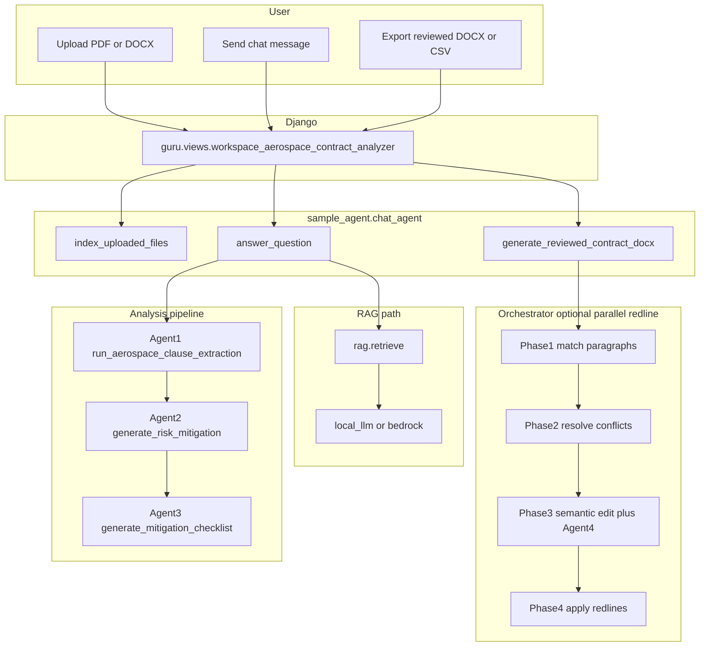

# Workflow and agents specification

This document is the single narrative for the **contractual_scaffolding** / Aerospace Contract Analyzer: what the system is for, how requests flow through Django to the agents, how many agents exist, what each one does, and how configuration toggles behavior. For URL wiring and local models, see [HOW_IT_IS_LINKED_AND_MODELS.md](HOW_IT_IS_LINKED_AND_MODELS.md). For PDF export details, see [PDF_REDLINING_FLOW.md](PDF_REDLINING_FLOW.md). For the original Agent 4 / pdf2docx integration plan, see [AGENTIC_WORKFLOW_PLAN.md](AGENTIC_WORKFLOW_PLAN.md).

---

## Executive summary and end goal

**End goal:** Support review of **supply-side** aerospace contracts by (1) extracting structured clause assessments against company legal positions, (2) surfacing **Red–Amber–Green (RAG)** risk with rationales and mitigations, (3) producing a compact **mitigation checklist** and optional **chat / counterfactuals** grounded in POC knowledge, and (4) exporting artifacts: **CSV**, **reviewed DOCX** with track-style redlines and margin comments, and optionally a **verification report** when post-edit checks flag issues.

**Business scope (POC):** [POC_SCOPE.md](POC_SCOPE.md) defines **ten critical legal positions** for the GB Legal POC (limitation of liability, governing law, dispute resolution, firm price, force majeure, liquidated damages, orders beyond termination, quantity protection, inventory, change orders). It also states that the POC applies only where **Aerospace is supplying goods**, that other agreement types are out of scope, and that outputs require Legal sign-off before commercial use.

**Implementation scope (code):** The primary extraction path in [agent1_clause_analyzer.py](../agent1_clause_analyzer.py) uses a fixed ordered list **`CLAUSE_NAMES` with 14 commercial clause topics** (e.g. Payment Terms, Bank Guarantees, Liquidated Damages, through Consequential Damages). That list drives aerospace-style extraction and reporting. The **10-position POC table** and the **14-name code list** are not identical: treat the POC document as the **product/legal scope narrative**, and Agent 1’s `CLAUSE_NAMES` as the **current automated checklist** the pipeline evaluates unless you change the code or knowledge alignment.

---

## How many agents?

The pipeline names **four agents**:

| # | Name | Role |
|---|------|------|
| 1 | Clause extraction | Build the authoritative `clause_table` from contract text + knowledge. |
| 2 | Risk reviewer | Turn that table into a RAG markdown report with mitigations. |
| 3 | Mitigation checklist | Derive a short checklist table from Agent 2’s output (no LLM). |
| 4 | Redline verifier | After proposed DOCX edits, optionally **pass** or **flag** for semantic/contextual fit. |

**Supporting modules** (not numbered as “Agent 5”):

- **Semantic edit generator** ([agents/sample_agent/semantic_edit_generator.py](../agents/sample_agent/semantic_edit_generator.py)): LLM-based in-place paragraph edits and evidence-to-clause validation during redlining.
- **Orchestrator** ([agents/sample_agent/orchestrator.py](../agents/sample_agent/orchestrator.py)): Sequences Agents 1–3 for analysis; runs parallel **redline phases** (match → resolve → edit) when enabled.
- **Redline DOCX builder** ([agents/sample_agent/redline_docx.py](../agents/sample_agent/redline_docx.py)): Matches evidence to paragraphs, applies edits, comments, and integrates Agent 4 (and optional parallel path).
- **Chat agent** ([agents/sample_agent/chat_agent.py](../agents/sample_agent/chat_agent.py)): Session state, uploads, `answer_question` (RAG + LLM), analysis orchestration entrypoints, and `generate_reviewed_contract_docx`.

---

## Request path (browser to code)

1. User opens `/aerospace/contract-analyzer/` (see [geg_guru/urls.py](../geg_guru/urls.py)).
2. [guru/views.py](../guru/views.py) `workspace_aerospace_contract_analyzer` handles GET/POST.
3. Actions include `upload`, `ask`, `reset`, `remove_file`, and exports (e.g. reviewed DOCX, CSVs) that call into **`agents.sample_agent.chat_agent`** as `sample_agent`.

The view does not call Bedrock or Ollama directly; it delegates to `sample_agent` functions.

---

## End-to-end workflows

### Journey A: Upload and analyze (Agents 1 → 2 → 3)

1. **Upload:** Files are validated, stored per session, and text extracted (PDF/DOCX, with PDF image fallback where implemented) via `index_uploaded_files`.
2. **Knowledge:** POC knowledge path comes from config ([agents/sample_agent/config.py](../agents/sample_agent/config.py) `POC_KNOWLEDGE_PATH`); payload feeds Agent 1.
3. **Trigger:** Structured analysis runs inside [answer_question](../agents/sample_agent/chat_agent.py) when the user sends a message (**action `ask`**) and both **uploaded full text** and **POC knowledge text** are available—not on upload alone.
4. **Pipeline:** [run_analysis_pipeline](../agents/sample_agent/orchestrator.py) in [orchestrator.py](../agents/sample_agent/orchestrator.py):
   - **Agent 1:** `run_aerospace_clause_extraction(contract_text, knowledge_payload)` → list of row dicts (`clause_table`).
   - **Agent 1 output as markdown:** Orchestrator builds an Agent-1-style table string for Agent 2.
   - **Agent 2:** `generate_risk_mitigation(agent1_output, po_text, terms_text)` → markdown including `## Risk Analysis and Details` and the RAG table.
   - **Agent 3:** `generate_mitigation_checklist(agent2_output)` → compact checklist markdown.
5. **UI:** [chat_agent.py](../agents/sample_agent/chat_agent.py) merges results into the response (clause table, risk details, checklist). If Agent 2/3 are missing, it may fall back to importing `agent2_reviewer` / `agent3_mitigation_checklist` directly.

**Agent 1 document priority:** When multiple sections exist, the analyzer respects **PO → SPC → GPC → TERMS** ([agent1_clause_analyzer.py](../agent1_clause_analyzer.py) `DOC_SECTIONS` / `DOC_PRIORITY`).

### Journey B: Generate reviewed DOCX (redline + optional Agent 4)

1. **Source document:** Prefer an uploaded DOCX. If the user uploaded **PDF only**, [generate_reviewed_contract_docx](../agents/sample_agent/chat_agent.py) can convert with **pdf2docx** for layout preservation; on failure it falls back to building a DOCX from extracted plain text ([PDF_REDLINING_FLOW.md](PDF_REDLINING_FLOW.md)).
2. **Instructions:** Rows from `clause_table` (Amber/Red with detected evidence) drive which clauses get edits.
3. **Phases (when parallel redline is enabled):** [orchestrator.py](../agents/sample_agent/orchestrator.py)
   - **Phase 1 – Match:** Per clause, validate evidence (including optional LLM evidence-to-clause check), find best paragraph index in the DOCX.
   - **Phase 2 – Resolve:** If multiple clauses target the same paragraph, keep the best match by score and risk precedence (Red over Amber over Green).
   - **Phase 3 – Edit:** Rule-based normalization, then optional **semantic** LLM edit; then **Agent 4** `verify_redline_edit` if enabled. Depending on `SKIP_REDLINE_WHEN_AGENT4_FLAGS`, a flag may prevent applying that redline while still recording it in the verification report.
   - **Phase 4 – Apply:** Sequential application of redlines and comments in [redline_docx.py](../agents/sample_agent/redline_docx.py).

When parallel redline is off, [redline_docx.py](../agents/sample_agent/redline_docx.py) follows an equivalent sequential logic with the same building blocks.

### Journey C: Chat and counterfactuals (separate from numbered agents)

On **action `ask`**, [answer_question](../agents/sample_agent/chat_agent.py) may use **RAG** (Chroma + embeddings over POC knowledge) plus **local or Bedrock LLM** to answer questions and split counterfactuals from the main reply. This path does not replace Agents 1–3 for the structured clause table; it complements the same session.

---

## Mermaid: high-level flow

---

## Agent reference (deep dive)

### Agent 1 — Clause analyzer

- **File:** [agent1_clause_analyzer.py](../agent1_clause_analyzer.py)
- **Primary entry:** `run_aerospace_clause_extraction(contract_text: str, knowledge_payload: dict) -> list[dict]`
- **Purpose:** Chunk and analyze contract text against knowledge clause definitions; return a **clause table** (rows with fields such as clause name, GB ideal position, risk level, detected status, rationale, evidence, references, mitigation hints depending on schema).
- **LLM:** Uses AWS Bedrock when `BEDROCK_MODEL_ID` and credentials are set; includes parsing, merging, and quality guards. Image fallback for PDFs may apply when text quality is poor (see module logging and `run_clause_analysis` patterns).
- **Grounding:** Strong emphasis on JSON evidence extraction and citation-style references; `CLAUSE_NAMES` defines **14** clause topics in order.

### Agent 2 — Risk reviewer

- **File:** [agent2_reviewer.py](../agent2_reviewer.py)
- **Primary entry:** `generate_risk_mitigation(agent1_output: str, po_text: str, terms_text: str) -> str`
- **Purpose:** Produce **Risk Analysis and Details** markdown with columns: Clause, Risk, RAG (🟥 🟧 🟩), Rationale, Mitigation, Evidence/Location.
- **LLM:** Bedrock via `call_bedrock_chat` when the Bedrock client is configured; otherwise behavior degrades per implementation (empty or stub paths—verify at runtime).
- **Static knowledge:** [rationale_mitigation.txt](../rationale_mitigation.txt) for rationale/mitigation text keyed by clause semantics.

### Agent 3 — Mitigation checklist

- **File:** [agent3_mitigation_checklist.py](../agent3_mitigation_checklist.py)
- **Primary entry:** `generate_mitigation_checklist(agent2_output_markdown: str) -> str`
- **Purpose:** Parse Agent 2’s pipe table and emit **Risk Mitigation Checklist** (Clause | Risk | Mitigation Recommendation), filtering to risky RAG rows.
- **LLM:** **None** — deterministic string parsing and table generation for stability and speed.

### Agent 4 — Redline verifier

- **File:** [agents/sample_agent/agent4_verifier.py](../agents/sample_agent/agent4_verifier.py)
- **Primary entry:** `verify_redline_edit(original_text, edited_text, clause_name, surrounding_context, gb_ideal) -> dict` with `verdict` in `pass` / `flag`, plus `reason` and `suggestion`.
- **Purpose:** Sanity-check that a proposed redline still reads coherently and does not hijack the paragraph with the wrong legal topic.
- **LLM:** Uses the same provider pattern as other sample_agent modules (local vs Bedrock per [config.py](../agents/sample_agent/config.py)); on parse errors, defaults to **pass** so export is not blocked.
- **Integration:** Invoked from [orchestrator.py](../agents/sample_agent/orchestrator.py) Phase 3 and from [redline_docx.py](../agents/sample_agent/redline_docx.py) on the sequential path. Verification rows can be exported (e.g. CSV) when the UI/view exposes that action.

### Semantic edit generator (supporting)

- **File:** [agents/sample_agent/semantic_edit_generator.py](../agents/sample_agent/semantic_edit_generator.py)
- **Key functions:** `generate_semantic_edit(...)` for in-place paragraph refinement; `validate_evidence_for_clause(...)` when `ENABLE_EVIDENCE_CLAUSE_VALIDATION` is on, to reduce wrong-clause evidence matches in Phase 1.

### Orchestrator (supporting)

- **File:** [agents/sample_agent/orchestrator.py](../agents/sample_agent/orchestrator.py)
- **Analysis:** `run_analysis_pipeline(uploaded_full_text, knowledge_payload)`
- **Redline:** `run_redline_phase1_match`, `run_redline_phase2_resolve`, `run_redline_phase3_edit` (ThreadPoolExecutor, `MAX_WORKERS = 4`)

---

## Configuration flags ([agents/sample_agent/config.py](../agents/sample_agent/config.py))

| Variable | Default (typical) | Meaning |
|----------|-------------------|---------|
| `LLM_PROVIDER` | `local` | `local` (Ollama-compatible HTTP) vs `bedrock`. |
| `LOCAL_LLM_BASE_URL` | `http://127.0.0.1:11434` | Ollama (or compatible) API base. |
| `LOCAL_LLM_MODEL` | `llama3.1:8b` | Chat model name for local provider. |
| `LOCAL_LLM_TEMPERATURE` / `TOP_P` / `MAX_TOKENS` | tuned low | Generation controls for local chat. |
| `ENABLE_BEDROCK` | `0` | When true, Bedrock path enabled alongside AWS env vars. |
| `AWS_REGION`, `AWS_ACCESS_KEY_ID`, `AWS_SECRET_ACCESS_KEY`, `BEDROCK_MODEL_ID` | (see file) | AWS Bedrock client configuration. |
| `POC_KNOWLEDGE_PATH` | default DOCX or JSON under `docs/knowledge/` | Canonical POC knowledge file. |
| `RAG_TOP_K` | `12` | Chunks retrieved per question. |
| `ENABLE_RAG` | `1` | Toggle RAG for `answer_question`. |
| `INDEX_UPLOAD_ON_UPLOAD` | `0` | Whether uploads are indexed into the vector store on upload. |
| `ENABLE_VECTOR_RETRIEVER` | `0` | Vector retriever enablement (see chat_agent usage). |
| `DEBUG_AGENT` | `0` | Verbose agent logging. |
| `ENABLE_AGENT4_VERIFICATION` | `1` | Call Agent 4 before applying each redline (when integrated). |
| `SKIP_REDLINE_WHEN_AGENT4_FLAGS` | `0` | If `1`, skip applying redline when verdict is `flag` (still report). |
| `ENABLE_SEMANTIC_EDIT_GENERATION` | `1` | Allow LLM semantic edits during redlining. |
| `EDIT_STRATEGY` | `semantic_first` | `semantic_first` vs `rule_first` in redline_docx edit ordering. |
| `ENABLE_EVIDENCE_CLAUSE_VALIDATION` | `1` | LLM validates evidence belongs to claimed clause (Phase 1). |
| `ENABLE_PARALLEL_REDLINE` | `0` | Use orchestrator parallel phases 1–3 vs legacy sequential flow. |
| `ENABLE_SEMANTIC_COMMENTS` | `1` | LLM-generated margin comments for edits. |
| `ENABLE_EDIT_SEMANTIC_VALIDATION` | `0` | Extra LLM check before applying edit. |
| `LOCAL_EMBED_MODEL` / `LOCAL_EMBED_BASE_URL` | defaults | Embedding model / optional remote embed API. |

Agent 1 and Agent 2 also read **`BEDROCK_MODEL_ID`** and AWS env vars directly from the environment in their modules for Bedrock calls.

---

## Related documents

- [DETAILED_REPORT.md](../DETAILED_REPORT.md) — Architecture summary (Agents 1–2 focus; extend mentally with Agents 3–4 and orchestrator).
- [POC_SCOPE.md](POC_SCOPE.md) — Ten POC positions and legal disclaimers.
- [HOW_IT_IS_LINKED_AND_MODELS.md](HOW_IT_IS_LINKED_AND_MODELS.md) — Django URLs, templates, RAG + local LLM chat path.
- [PDF_REDLINING_FLOW.md](PDF_REDLINING_FLOW.md) — PDF → DOCX and redline steps.
- [AGENTIC_WORKFLOW_PLAN.md](AGENTIC_WORKFLOW_PLAN.md) — Agent 4 and pdf2docx integration history and status.
- [DOCX_REDLINE_CROSSCHECK_FINDINGS.md](../DOCX_REDLINE_CROSSCHECK_FINDINGS.md) — How clause_table, fallbacks, and redlining interact.

---

## Key source files (quick index)

| Path | Responsibility |
|------|----------------|
| [agent1_clause_analyzer.py](../agent1_clause_analyzer.py) | Agent 1 extraction |
| [agent2_reviewer.py](../agent2_reviewer.py) | Agent 2 RAG markdown |
| [agent3_mitigation_checklist.py](../agent3_mitigation_checklist.py) | Agent 3 checklist |
| [agents/sample_agent/agent4_verifier.py](../agents/sample_agent/agent4_verifier.py) | Agent 4 verification |
| [agents/sample_agent/orchestrator.py](../agents/sample_agent/orchestrator.py) | Pipeline + parallel redline phases |
| [agents/sample_agent/redline_docx.py](../agents/sample_agent/redline_docx.py) | DOCX redline application |
| [agents/sample_agent/semantic_edit_generator.py](../agents/sample_agent/semantic_edit_generator.py) | Semantic edits + evidence validation |
| [agents/sample_agent/chat_agent.py](../agents/sample_agent/chat_agent.py) | Session, analyze, chat, exports |
| [guru/views.py](../guru/views.py) | HTTP entry for workspace |

This spec reflects the codebase layout under `contractual_scaffolding`; if you copy the agent into another repo (e.g. `geg_guru`), adjust paths to match that deployment.
